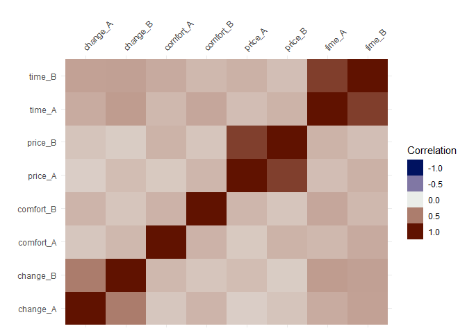
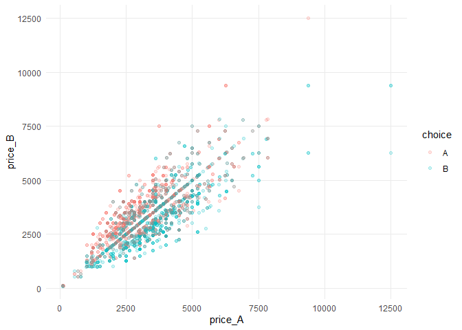
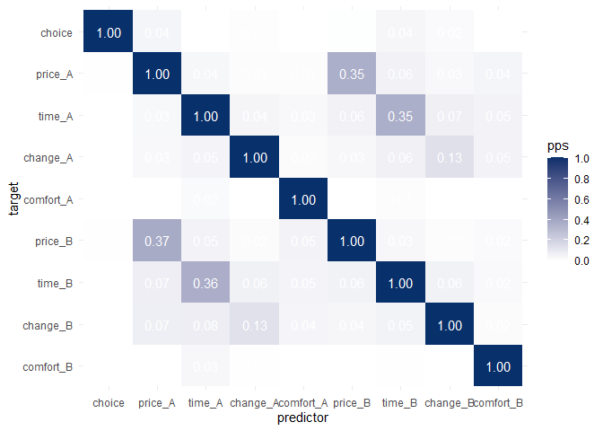
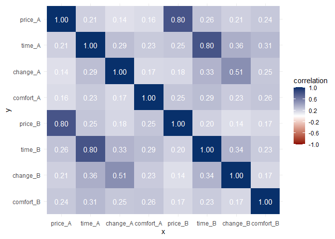
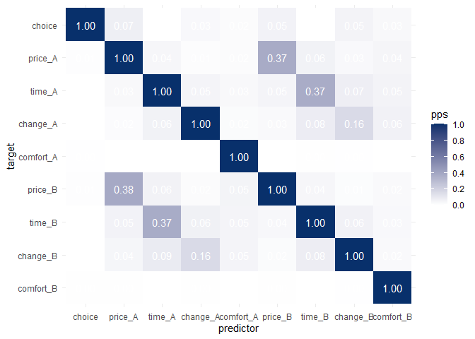

Exploring the Train dataset
================

## First look at Train dataset

``` r
data("Train")
train_choice_data <- Train %>% as_tibble()
train_choice_data %>% glimpse()
```

    ## Rows: 2,929
    ## Columns: 11
    ## $ id        <int> 1, 1, 1, 1, 1, 1, 1, 1, 1, 1, 2, 2, 2, 2, 2, 2, 2, 2, 2, ...
    ## $ choiceid  <int> 1, 2, 3, 4, 5, 6, 7, 8, 9, 10, 1, 2, 3, 4, 5, 6, 7, 8, 9,...
    ## $ choice    <fct> A, A, A, B, B, B, B, B, A, A, A, A, B, B, B, B, A, B, B, ...
    ## $ price_A   <dbl> 2400, 2400, 2400, 4000, 2400, 4000, 2400, 2400, 4000, 240...
    ## $ time_A    <dbl> 150, 150, 115, 130, 150, 115, 150, 115, 115, 150, 108, 93...
    ## $ change_A  <dbl> 0, 0, 0, 0, 0, 0, 0, 0, 0, 0, 0, 0, 0, 0, 0, 0, 0, 0, 0, ...
    ## $ comfort_A <dbl> 1, 1, 1, 1, 1, 0, 1, 1, 0, 1, 0, 1, 0, 1, 1, 0, 0, 0, 1, ...
    ## $ price_B   <dbl> 4000, 3200, 4000, 3200, 3200, 2400, 3200, 3200, 3200, 400...
    ## $ time_B    <dbl> 150, 130, 115, 150, 150, 130, 115, 150, 130, 115, 121, 93...
    ## $ change_B  <dbl> 0, 0, 0, 0, 0, 0, 0, 0, 0, 0, 0, 0, 0, 0, 0, 0, 0, 0, 0, ...
    ## $ comfort_B <dbl> 1, 1, 0, 0, 0, 0, 1, 0, 1, 0, 1, 0, 1, 1, 0, 0, 0, 1, 1, ...

``` r
train_choice_data %>%
  select(where(is.numeric)) %>% 
  select(-ends_with("id")) %>% 
  vis_cor()
```



``` r
train_choice_data %>%
  ggplot() +
  geom_point(aes(x = price_A, y = price_B, colour = choice), alpha = 0.2) +
  theme_minimal() +
  theme(panel.grid.minor = element_blank())
```



## Look at Predictive Power Score

From <https://github.com/paulvanderlaken/ppsr>:

"the Predictive Power Score (PPS)...is an asymmetric, data-type-agnostic score that can detect linear or non-linear relationships between two variables. The score ranges from 0 (no predictive power) to 1 (perfect predictive power).

The general concept of PPS is useful for data exploration purposes, in the same way correlation analysis is."

``` r
library(ppsr)
```

    ## Warning: package 'ppsr' was built under R version 4.0.5

``` r
score_df(train_choice_data) %>% glimpse()
```

    ## Rows: 121
    ## Columns: 11
    ## $ x              <chr> "id", "choiceid", "choice", "price_A", "time_A", "ch...
    ## $ y              <chr> "id", "id", "id", "id", "id", "id", "id", "id", "id"...
    ## $ result_type    <chr> "predictor and target are the same", "predictive pow...
    ## $ pps            <dbl> 1.0000000000, 0.0000000000, 0.0000000000, 0.01624525...
    ## $ metric         <chr> NA, "MAE", "MAE", "MAE", "MAE", "MAE", "MAE", "MAE",...
    ## $ baseline_score <dbl> NA, 58.6809026, 58.6809026, 58.6809026, 58.6809026, ...
    ## $ model_score    <dbl> NA, 58.6809026, 58.6809026, 57.7260745, 58.6809026, ...
    ## $ cv_folds       <dbl> NA, 5, 5, 5, 5, 5, 5, 5, 5, 5, 5, 5, NA, 5, 5, 5, 5,...
    ## $ seed           <dbl> NA, 1, 1, 1, 1, 1, 1, 1, 1, 1, 1, 1, NA, 1, 1, 1, 1,...
    ## $ algorithm      <chr> NA, "tree", "tree", "tree", "tree", "tree", "tree", ...
    ## $ model_type     <chr> NA, "regression", "regression", "regression", "regre...

``` r
train_choice_data %>% 
  select(-ends_with("id")) %>% 
  visualize_pps(do_parallel = TRUE)
```



``` r
train_choice_data %>% 
  select(-ends_with("id")) %>% 
  visualize_correlations()
```



It's possible that the default algorithm (decision tree) isn't finding good splits. Try GLM instead.

``` r
train_choice_data %>% 
  select(-ends_with("id")) %>% 
  visualize_pps(algorithm = "glm", do_parallel = TRUE)
```



There's not much difference.

## Data management with mlogit

From <https://cran.r-project.org/web/packages/mlogit/vignettes/c2.formula.data.html>.

``` r
Tr <- train_choice_data %>% 
  mutate(choiceid = row_number()) %>% 
  dfidx(shape = "wide", varying = 4:11, sep = "_",
        idx = list(c("choiceid", "id")),
        idnames = c(NA, "alt")) %>% 
  mutate(price = price/ 100 * 2.20371, time = time / 60)
Tr
```

    ## # A tibble: 5,858 x 6
    ##    choice price  time change comfort idx$choiceid   $id $alt 
    ##  * <fct>  <dbl> <dbl>  <dbl>   <dbl>        <int> <int> <fct>
    ##  1 A       52.9  2.5       0       1            1     1 A    
    ##  2 A       88.1  2.5       0       1            1     1 B    
    ##  3 A       52.9  2.5       0       1            2     1 A    
    ##  4 A       70.5  2.17      0       1            2     1 B    
    ##  5 A       52.9  1.92      0       1            3     1 A    
    ##  6 A       88.1  1.92      0       0            3     1 B    
    ##  7 B       88.1  2.17      0       1            4     1 A    
    ##  8 B       70.5  2.5       0       0            4     1 B    
    ##  9 B       52.9  2.5       0       1            5     1 A    
    ## 10 B       70.5  2.5       0       0            5     1 B    
    ## # ... with 5,848 more rows
    ## 
    ## ~~~ indexes ~~~~
    ##    choiceid id alt
    ## 1         1  1   A
    ## 2         1  1   B
    ## 3         2  1   A
    ## 4         2  1   B
    ## 5         3  1   A
    ## 6         3  1   B
    ## 7         4  1   A
    ## 8         4  1   B
    ## 9         5  1   A
    ## 10        5  1   B
    ## indexes:  1, 1, 2
